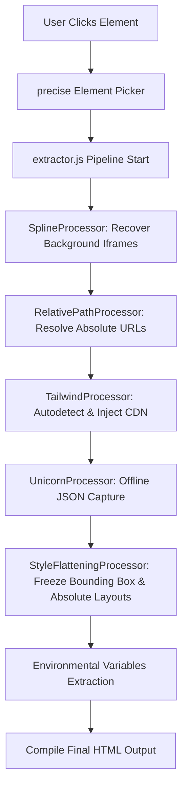

# Case Study: Smart UI Decompiler Chrome Extension

This case study documents the engineering decisions, technical challenges, and solutions implemented during the development of the **Smart UI Decompiler** Chrome extension. The goal was to build a clean, accurate system for extracting high-fidelity UI elements from complex design websites and modern visual builders (such as Framer, Webflow, WebGL scenes, and Spline 3D).

---

## 🛑 Technical Challenges & Pitfalls Encountered

During development, we faced five core layout, rendering, and security bottlenecks. Here is a detailed analysis of each problem and its engineering solution:

### Challenge 1: Unicorn Studio Origin Protection Bypass
* **The Problem**: Unicorn Studio WebGL animations require a project ID (`data-us-project`) to fetch scene configuration JSON from their servers. When running the extracted component locally (`localhost` or `file://`), the server returned unauthorized responses since it checks the request's origin and blocks unauthorized hosts.
* **The Solution**: 
  - We implemented a message-passing flow using the extension's background service worker (`background.js`). The content script delegates the scene fetch request to `background.js`, which has higher privileges and bypassed the client's page-level CSP policies.
  - In the pipeline, `UnicornProcessor` strips the `data-us-project` attribute, replaces it with `data-us-project-src` pointing to a unique local script ID, and appends the returned scene JSON directly inside a `<script type="application/json">` node. The animation now loads instantly offline with zero network lookups.

### Challenge 2: Hidden Absolute Spline 3D Background Iframes
* **The Problem**: Spline interactive backdrops are usually nested inside sibling absolute containers with a negative `z-index` (e.g. Tailwind `-z-10`). When extracting a foreground card or text block in standalone mode, the sibling background iframe wrapper is lost, causing a white page screen instead of a rich 3D backdrop.
* **The Solution**:
  - We engineered `SplineProcessor` to traverse up the DOM tree from the selected element to find a logical wrapper container.
  - The processor queries the wrapper subtree for any container containing an `iframe` with a negative computed `z-index` style.
  - The background container is cloned, forced to `z-index: 0 !important`, and bundled inside the output code. The foreground component is then raised to `z-index: 1` relative layout to keep it positioned cleanly on top of the 3D canvas.

### Challenge 3: DOM Overclimbing & Sibling Overfetching
* **The Problem**: Visual site builders nest elements inside generic wrappers. Our initial extractor walked up the DOM tree automatically looking for wrappers. In complex builders like Webflow Designer, this climbed into the designer's main shell, pulling down sidebars, editor widgets, and unwanted layout controls.
* **The Solution**:
  - We restricted parent element climbing for the main component. The element highlighted and clicked by the user is the **exact** node targeted for cloning (preventing sibling overfetching).
  - We preserved `findLogicalComponent` exclusively as a boundary check to limit climbing when searching for background iframes, adding stop-words that detect layout shell classes (like `w-designer`, `preview-shell`, and `editor-wrapper`) to stop traversal immediately.

### Challenge 4: Framer Motion Layout Collapses & Position Shifts
* **The Problem**: Interactive sites use absolute positioning extensively. When extracting individual nodes, these elements lose their parent layout context (e.g. flex rows, grid sizes, or parent widths), resulting in children overlapping or piling up in the top-left corner of the page.
* **The Solution**:
  - We enhanced `StyleFlatteningProcessor`. During tree flattening, it captures the real calculated layout bounds (`getBoundingClientRect`) of the live element on the screen.
  - For the **Root Container**: It freezes the width in pixels, sets `max-width: 100%` to preserve responsiveness, keeps center margins, and applies `box-sizing: border-box !important` with original display properties.
  - For **Child Elements**: It maps the relative properties (`position: absolute`, `width`, `height`, `top`, `left`, `right`, `bottom` in pixels) as inline style overrides on the cloned nodes, securing structural coordinates.

### Challenge 5: Environmental Theme Shock
* **The Problem**: Extracted HTML elements lost global CSS variables (`--custom-properties`), custom fonts, and root classes, breaking theme alignment, typography, and dark mode toggles.
* **The Solution**:
  - The decompiler scans the original document's root `<html>` and `<body>` computed styles.
  - It extracts all custom CSS variables starting with `--` and bundles them inside a global `:root` rule block.
  - It copies all class names and inline style definitions from the original `<html>` and `<body>` tags directly into the exported document context, matching the runtime atmosphere.

---

## 📐 Pipeline Architecture

To prevent processing conflicts between different layout engines, we structured `extractor.js` using a modular processor pipeline:

---

## 📈 Key Takeaways

1. **Prioritize Runtime Computed Metrics**: Cloned elements in memory lack a rendering context. We must read computed layout properties from live nodes before duplicating or modifying them.
2. **Isomorphic Shell Isolation**: Fully capturing a web component requires bringing its environmental parameters (CSS variables, root classes, CDNs) along with it.
3. **Pipeline Modularization**: Separating DOM manipulation into isolated, step-by-step processors makes debugging layout edge cases reliable.
